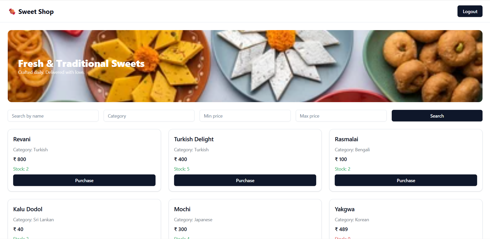
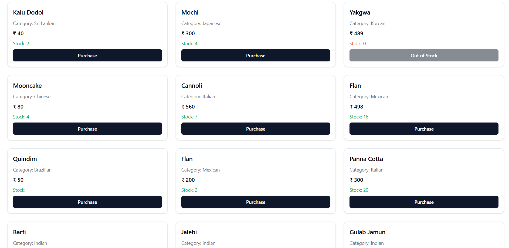
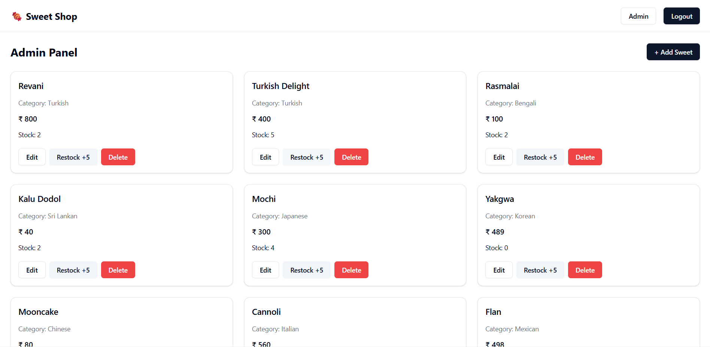
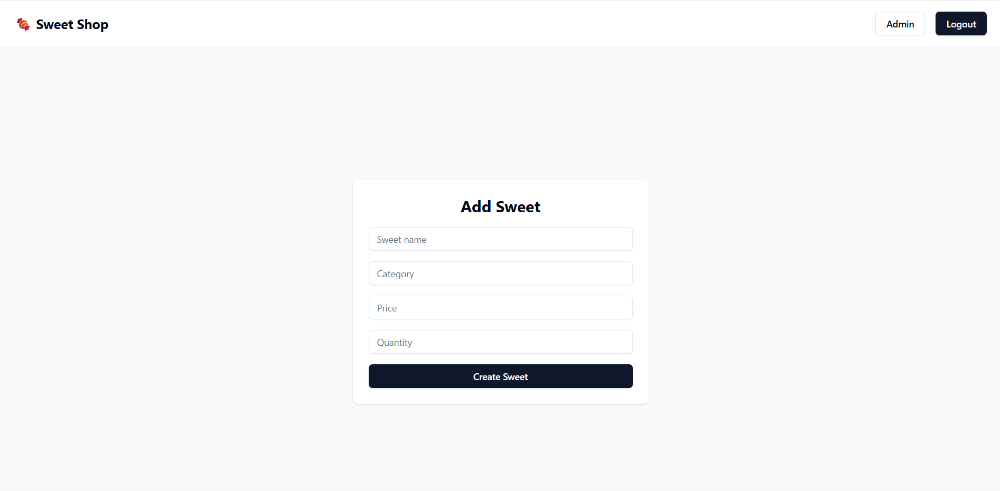
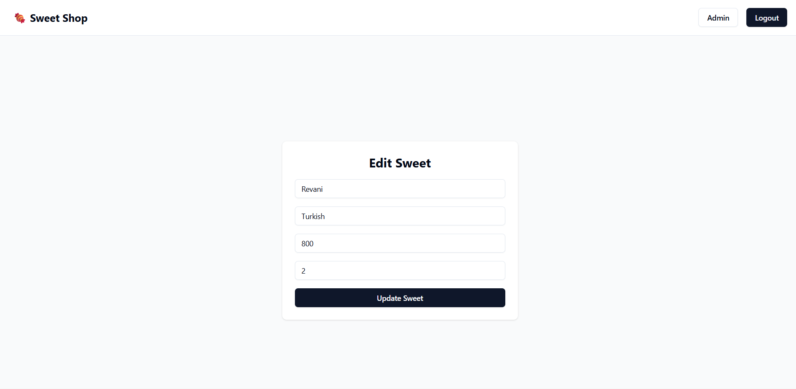
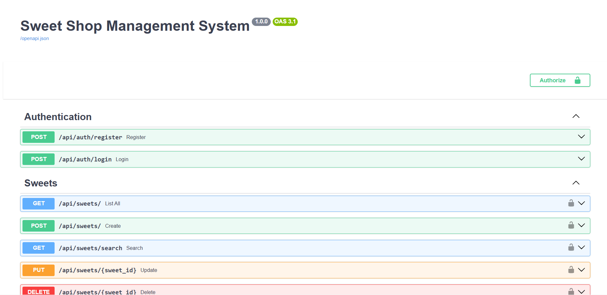

Sweet Shop Management System
----------------------------

A full-stack Sweet Shop Management System built using FastAPI, PostgreSQL, and React following Test-Driven Development (TDD) principles.
The application supports user authentication, role-based access control, inventory management, and a modern, responsive frontend.

Features
--------

Authentication & Authorization
    User registration and login
    JWT-based authentication
    Role-based access (User / Admin)

User Features
    View available sweets
    Search sweets by name, category, and price range
    Purchase sweets (stock decreases automatically)
    Purchase button disabled when stock is zero

Admin Features
    Add new sweets
    Edit sweet details
    Delete sweets
    Restock inventory
    Admin-only routes and UI protections

Technical Highlights
    RESTful API using FastAPI
    PostgreSQL database
    Automated backend tests (pytest)
    React + Vite frontend
    Clean commit history with AI co-author attribution

Tech Stack
----------

Backend
    Python
    FastAPI
    SQLAlchemy
    PostgreSQL
    Alembic
    Pytest

Frontend
    React
    TypeScript
    Vite
    Tailwind CSS
    Axios
    React Router

Project Structure
-----------------

sweetshop/
│
├── backend/
│   ├── app/
│   │   ├── main.py
│   │   ├── core/
│   │   ├── models/
│   │   ├── routes/
│   │   ├── schemas/
│   │   ├── services/
│   │   └── utils/
│   │
│   ├── alembic/
│   │   ├── versions/
│   │   └── env.py
│   │
│   ├── tests/
│   ├── requirements.txt
│  
│
├── frontend/
│   ├── src/
│   │   ├── api/
│   │   ├── components/
│   │   ├── context/
│   │   ├── pages/
│   │   ├── routes/
│   │   ├── App.tsx
│   │   └── main.tsx
│   │
│   ├── public/
│   ├── index.html
│   ├── package.json
│   ├── vite.config.ts
│   ├── tailwind.config.js
│   
│
├── README.md           
└── .gitignore

Setup & Run Locally
-------------------

1. Backend Setup
    cd backend
    python -m venv venv
    source venv/bin/activate   # Windows: venv\Scripts\activate
    pip install -r requirements.txt

    Configure database in .env (example):
        DATABASE_URL=sqlite:///./test.db
        SECRET_KEY=your_secret_key

    Run backend:
        uvicorn app.main:app --reload

        Backend runs at: http://127.0.0.1:8000
        
        Swagger Docs: http://127.0.0.1:8000/docs
        
2. Frontend Setup

    cd frontend
    npm install
    npm run dev

    Frontend runs at: http://localhost:5173
    

Test Report
-----------

Backend Tests
    Tests were written following Test-Driven Development (TDD) practices using pytest.

    Covered areas:

        User registration & login
        Authentication & authorization
        Sweets CRUD operations
        Inventory purchase & restock logic
        Role-based access validation

        Run tests: cd backend
                   pytest

Screenshots
-----------

### Login Page

### Registration Page

### User Dashboard

### Purchase Disabled When Out of Stock

### Admin Dashboard

### Add Sweet Page

### Edit Sweet Page

### API Documentation (Swagger)

My AI Usage
-----------
AI Tools Used
    ChatGPT (OpenAI)
    Gemini

How I Used AI
    To brainstorm API endpoint structure and REST conventions
    To generate initial boilerplate for FastAPI routes and React components
    To debug integration issues between frontend and backend
    To refine test cases and validate TDD flow
    To review code structure and improve readability and maintainability

My Reflection on AI Usage

AI significantly accelerated development by reducing time spent on repetitive boilerplate and debugging.
However, all AI-generated code was reviewed, modified, and validated manually to ensure correctness, security, and alignment with project requirements
I treated AI as a collaborative assistant, not a replacement for engineering judgment.